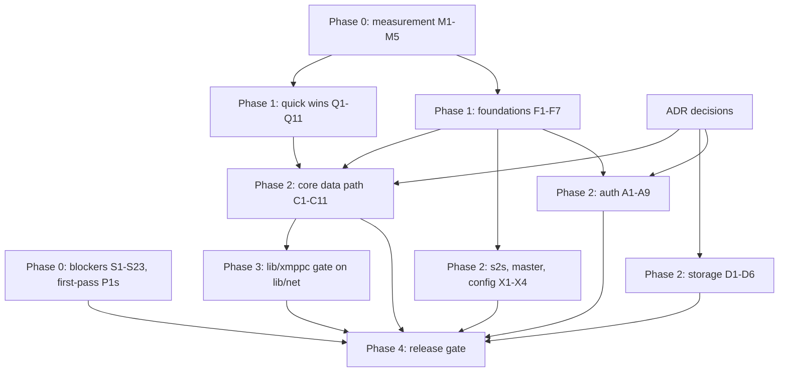

# xmppd v0.9.1: Performance and Refactor Plan (T197)

Status: **PROPOSED**. Nothing below is implemented. Phase 0 can start now;
Phases 2+ wait on the architecture decisions in section 4.

- Date: 2026-10-04. Tree: `master` 2219f7d (v0.9.0 = 3f14f21, plus the first
  version of this document).
- Scope: v0.9.0 was meant to be the deep performance and refactor release and
  was tagged early. v0.9.1 carries that charter. Performance and refactoring
  have equal weight and are planned together: each refactor below is chosen
  because it removes a cost, and each performance change lands as a structural
  fix rather than a local patch.
- Records: Phorge T197 (milestone `v0.9.1`, PHID-PROJ-mfsmx2n2yicpsqhyll4k),
  Continuum scope `XMPPD` (task map in Appendix E).

Evidence legend used throughout:

- **[V]** verified by direct read of the cited lines during this review.
- **[M]** measured (command and result recorded in section 1 or 6).
- **[S]** reported with file:line evidence by a module review pass; re-verify
  when the task is picked up.

## Contents

1. Baseline
2. Diagnosis: seven structural causes
3. Phase 0: blockers found during the review
4. Architecture decisions (ADR-1 to ADR-12)
5. Work plan (workstreams, dependencies, exit criteria)
6. Measurement plan
7. v0.9.1 release gate
8. Engineering rules for the refactor
- Appendix A: disposition of first-pass findings T249-T337
- Appendix B: first-pass sweep tables (2026-10-04, unchanged content)
- Appendix C: silent-drop inventory
- Appendix D: per-stanza cost model
- Appendix E: task map

---

## 1. Baseline

| Item | Value | Source |
|------|-------|--------|
| Unit tests | `zig build test`: 118/118 steps, 983/983 tests pass | [M] dev1, 2026-10-04 |
| Code size | 55.8k lines of Zig in `src/` + `lib/`; `server.zig` 4622, `muc_handler.zig` 2467, `iq_handler.zig` 2227, `s2s/main.zig` 2073 | [M] `wc -l` |
| `@sizeOf(Session)` | 64,024 B, built by value in `Session.init` and memcpy'd on every accept, plus two 24,752 B `Connection` copies | [M] objdump of `acceptConnections` (Debug build) |
| `router.dispatchStanza` frame | 117,696 B with `__zig_probe_stack`, every routed stanza. Declared buffers alone: `aug_buf` 16512 + three 20480 B stanza buffers | [M] objdump; [V] router.zig |
| Other large frames | `router.sendCarbons` 50,248 B; `muc_handler.handleMucGroupchat` 42,592 B | [M] objdump |
| Process allocator | `std.heap.GeneralPurposeAllocator(.{})` in every daemon. In Zig 0.15.2 that is `DebugAllocator`: one mutex, safety checks on in ReleaseSafe (the FreeBSD port's build mode). xmppd-core shares one instance across all worker threads | [V] `core/main.zig:60,369`; port `Makefile` |
| Load envelope (T242) | ~480 establishments/s at 10k sessions (pacing-limited); saturation 597-628 logins/s at w4 with ECDSA; at overload SASL p50 2.28 s, STARTTLS p50 1.53 s | board `XMPPD/load-driver-measurements-v2` |
| Rig caveat | T242 ran one account with `rate_limit=false`, so the auth credential cache always hit. Production login cost is higher | [S] |

No server-side loop timing, allocation counts or drop counters exist today.
Section 6 adds them before any performance change lands, so every claim in
this plan gets a before/after number.

## 2. Diagnosis: seven structural causes

Most of the ~150 findings (first pass plus this review) trace back to seven
causes. Fixing the causes is cheaper than fixing the symptoms one at a time,
and it is the only way to stop the same defect classes from coming back.

**D1. SAX re-assembly instead of stanza-at-a-time processing.**
The reader emits element/text events; `server.zig:1218-1816` reassembles every
stanza by re-serializing those events into fixed per-session buffers, steered
by about 20 "collecting" flags (`Session`, `server.zig:172-377`, ~70 fields
used only for reassembly). Every token is copied three times by the parser
(scanner buffer, token arena, reader arena) [V], then re-serialized and
re-escaped by the server, then serialized again per recipient. Escaping is
applied in some places and not others, which is the root of the stanza
injection in S1. The reader arena is never reset (S11).

**D2. No output abstraction.**
`Connection` has a fixed 16 KiB write buffer; 85 `queueSend` call sites swallow
`WriteBufferFull` and none handles it [V]. "Queue then arm EVFILT_WRITE" is
copy-pasted ~65 times; every delivered stanza costs an EV_ADD, an extra loop
iteration and an EV_DELETE. XEP-0198 counting is opt-in per call site (S15).
The TLS retry pin covers the pointer but not the length (S23).

**D3. Fixed-size cross-worker slots.**
`DeliverySlot` holds a 4080 B inline payload in a 256-slot ring per worker;
session ids double as message-type sentinels; each stanza costs a pipe
`write(2)` [V]. Anything over 4080 B is dropped silently (S14). Room mailboxes
are 16 inline slots of 4080 B and drop when full (S16).

**D4. Global shared state on the hot path.**
One DebugAllocator mutex serializes every allocation of every worker. One
`RwLock` guards the `SessionMap`; every lookup formats a JID string into a
stack buffer and hashes it under the lock; generation validation scans the
whole map (T255); `bind`/`unbind` write a log line while holding the
exclusive lock (`session_map.zig:156-206, 220-257`) [V].

**D5. Storage on the event loop.**
Each LMDB call opens its own transaction (read: calloc + value copy; write:
commit with two syncs) on the worker loop [S]; MAM and MUC history copy whole
archives per query [S]; namespace handles are created lazily from all threads
without a lock (S9).

**D6. Duplicated infrastructure.**
Six event-loop variants, three copies of the buffered TLS connection
(`core/connection.zig`, `s2s/session.zig`, `s2s/connector.zig`), three IPC
framing copies, four wake pipes, four listener binds, two DANE implementations
and per-daemon config parsing [S]. Fixes land in one copy and miss the others:
the T238 fd purge never reached s2s (T277); the T236 wake coalescing never
reached core (T267).

**D7. Fixed caps that truncate silently.**
16-entry route buffers against a 256-resource default (S18); 64-entry SM-ID map
(S17); 256 rooms and 128 occupants per worker; 256 persistent rooms loaded at
start (S19); 16 KiB stanza buffer; 4 KiB `write_scratch` for roster and
blocklist replies [S].

---

## 3. Phase 0: blockers found during the review

These are security, crash and data-loss defects. They are not performance
work, but they were found during it and must not ship again. Each one is
small, independent, lands on its own branch with a regression test, and does
not wait for any ADR. Where a later workstream replaces the code, the hotfix
is still done first so the fix ships even if that ADR is rejected.

### 3.1 New findings (verified)

| ID | Class | Finding | Evidence | Fix |
|----|-------|---------|----------|-----|
| S1 | security, high | **Stanza injection / `from` forgery.** Attribute entity references are decoded (`&apos;` becomes `'`) and the decoded `id`/`to`/`type` values are written back inside `'...'` with no escaping, so a client can close the attribute and append a second stanza with any `from`. Namespace URIs are re-emitted raw too. Root cause of T264/T265/T266. | `lib/xml/scanner.zig:366-370`; `server.zig:2464-2466`; `router.zig:539-541, 600-616`; also muc/presence/s2s writers [V]; `server.zig:2507, 2511` [V] | Hotfix: one `escapeAttr` at every attribute write, including namespace URIs; tests with `&apos;`, `&lt;`, `&quot;`. Structural: C1 (StanzaWriter) and C5 (raw-span forwarding). |
| S2 | security, high | **Inbound s2s `from`/`to` not validated.** Established inbound sessions forward any stanza whose `from`/`to` are non-empty; the `from` domain is never compared with the authenticated peer domain, nor `to` with served hosts. Any federated peer can speak as any local user. | `s2s/main.zig:961-970, 1115-1122` [V] | Check `from` domain against the dialback/EXTERNAL/DANE-authenticated domain (`<invalid-from/>`, RFC 6120 §4.9.3.9) and `to` against served hosts (`<host-unknown/>`, §4.9.3.6). |
| S3 | security, high | **Permanent account locks are never enforced.** Core always sends `username = ""`; the only lock check requires `username.len > 0`. Same bug class v0.8.11 fixed for the rate limiter. The OIDC daemon wires no lock checker [S]. | `server.zig:1888`; `auth/handler.zig:286-287` [V] | `policy.admit(username, ip)` called by every mechanism once the identity is parsed; fail closed on lock-store errors; locked-user tests for PLAIN and SCRAM. |
| S4 | DoS, high | **Unbounded store keys.** `compositeKey` memcpys owner + contact into a 512 B stack buffer; the roster item JID from the client is only checked for `len == 0`. In ReleaseSafe a ~600 B JID aborts xmppd-core (every session drops). Same pattern in block and PEP stores [S]. | `store/roster_store.zig:79-80, 294-300`; `iq_handler.zig:844-848` [V] | `store/keys.zig` bounded `KeyBuf` (max 511, the LMDB key limit) returning `error.KeyTooLong`; JID length validation at ingress; map to `<jid-malformed/>` / `<not-acceptable/>`. |
| S5 | crash, high | **MUC worker mask overflow.** `worker_mask` is `u16`; the master allows up to 64 workers and defaults to the CPU count. `@as(u16,1) << @intCast(worker_id)` panics for worker 16+ in safe builds. freebsd-dev1 has 20 cores. | `room_registry.zig:110, 194, 216, 240, 242`; `master/main.zig:333-336` [V]; `muc_handler.zig:972`, `server.zig:3180` [S] | `std.bit_set.IntegerBitSet(64)`; comptime assert against `MAX_WORKERS`; test with worker_id 63. |
| S6 | memory safety, high | **Use-after-free on remote kick.** When a remote moderator's kick empties a non-persistent room, `destroyRoom` frees the `Room` whose mailbox holds the payload that `ev.room_jid`/`ev.iq_id` point into; both are read afterwards. | `muc_handler.zig:2338-2359`; `room_registry.zig:324-330`; `server.zig:3075-3100` [V] | Never destroy inside actor processing (defer to `cleanupEmptyRooms`, the documented single destroy site); reject self-kick (XEP-0045). Same for the local twin [S]. |
| S7 | security, high | **Privilege drop keeps root's groups; children inherit every listener.** `setgid` + `setuid` only, no `setgroups`; listeners are created without CLOEXEC and children never `closefrom`, so auth and s2s hold all c2s listeners and root's supplementary groups (wheel, operator on dev1). | `master/supervisor.zig:125-132`; `master/main.zig:341` [V] | `setgroups(1, &gid)` before `setgid`; per-child fd remap to 3.. then `closefrom`; SOCK_CLOEXEC on listeners. |
| S8 | security, high | **OIDC HTTP client does not verify the hostname.** `SSL_VERIFY_PEER` plus SNI, but no `SSL_set1_host`: any publicly trusted certificate is accepted for the IdP token, introspection and JWKS endpoints. A new `SSL_CTX` (CA bundle parsed) is built per request. | `lib/http/client.zig:90-103, 270-299` [V] | `SSL_set1_host`; one `SSL_CTX` per daemon. DANE-first per policy lands in A8. |
| S9 | crash, high | **LMDB backend thread safety.** (a) The namespace-handle cache is appended from all worker threads with no lock (no mutex in the file); (b) on `MDB_MAP_FULL` any worker doubles `map_size` and resizes the env while other threads hold read transactions, which LMDB documents as unsafe. Default map 64 MiB. | `store/lmdb.zig:84-93, 254-258`; `store/backend.zig:37` [V] | Open every namespace inside `open()`; configurable large map (address space is cheap on amd64); never resize at runtime; warn at 80% via `mdb_env_info`. Same lazy-create pattern in RocksDB/SQLite backends [S]. |
| S10 | outage, high | **Core worker spins at 100% CPU after IPC backpressure.** `flushIpc`/`flushS2sIpc` add a persistent `EVFILT_WRITE` and nothing removes it; an idle unix socket is always writable, so `kevent()` never blocks again. s2s re-arms a persistent write on TLS handshake WANT_WRITE; later `addWriteOnce` calls cannot make that knote one-shot again, because FreeBSD only changes an existing knote's flags through `EV_FORCEONESHOT` (`/usr/src/sys/kern/kern_event.c:1877`) [V line 914; S line 1713]. | `server.zig:1966-1974, 2320-2328`; `event_loop.zig:217-220`; `s2s/main.zig:914` [V] | Remove the write filter on drain (or ONESHOT); route flush errors to `dropIpcAuth`; `addWriteOnce` in s2s handshakes. |
| S11 | memory, high (v0.9.0 regression) | **T249 is a regression.** The T232 fix (6190d36) deleted the per-stanza `arena.reset` and its bounding test ("reader: arena stays bounded over many stanzas"). Every token is retained for the life of the connection (~1.9x of received bytes [S]). | `git show 6190d36 -- lib/xml/reader.zig` [V] | Restore the reset at depth-1 boundaries after fixing the borrowers held across stanzas (`reg_pending_iq_id` at `iq_handler.zig:1032/1097/1130`, T306, s2s `remote_domain`) [S]; restore the test. Structural: C5. |
| S12 | correctness, high | **Namespace stack desync past depth 16.** Push is guarded by capacity, pop is unconditional; the server accepts depth 50. One deep stanza corrupts the stream's default namespace (xmppc recipients then drop every later stanza [S]). | `lib/xml/reader.zig:157, 232`; `server.zig:130` [V] | `error.TooDeep` when the stack is full; `max_depth <= stack`; test. |
| S13 | data loss, high | **Offline delivery deletes undelivered messages.** `queueSend ... catch continue`, then `clearAll` removes every pointer. A backlog larger than the write buffer is lost. | `session_lifecycle.zig:494-505` [V] | Delete only delivered ids; stream the rest (C2). |
| S14 | data loss, high | **Cross-worker stanzas over 4080 B are dropped silently.** The serializer returns before `ds.deliver`, and the router has already set `remote_delivered`, so there is no offline store and no bounce. | `router.zig:243-253, 596-627`; `delivery_queue.zig:28` [V] | Interim: treat too-large as undeliverable (offline or bounce) plus a counter. Structural: C4 (variable-size blobs). |
| S15 | data loss, high | **XEP-0198 counting is opt-in.** `iq_handler` sends 33 times and `muc_handler` 12 times without `smTrackOutbound`; the ack maps `h` by position, so each untracked stanza makes the next `<a/>` discard one stanza the client never received. Allocation failure in `push` also advances the sequence without an entry. | `sm_state.zig:125-140`; `server.zig:426-454`; call-site counts [V] | Interim: count in the shared IQ/MUC send helpers. Structural: C2 (`Outbox.stanza()` always counts, `nonza()` never does). |
| S16 | data loss, medium | **Room mailbox drops.** 16 slots; one MPSC drain can hand a room up to 256 messages; overflow is logged and dropped. | `server.zig:3005-3013`; `room_mailbox.zig:23` [V] | C4 (heap deque with byte budget and explicit error to sender). |
| S17 | correctness, medium | **SM-ID map.** Fixed 64-entry open addressing; insert silently fails when full; removal clears `occupied` without tombstones, so later entries in a probe chain become unfindable (spurious `item-not-found` on resume). | `server.zig:587, 4044-4075` [V] | `std.AutoHashMapUnmanaged([32]u8, usize)`. |
| S18 | correctness, medium | **16-entry route buffers vs 256 resources.** Bare-JID routing, carbons, presence, PEP and roster pushes copy into `[16]SessionEntry`; extra resources are skipped silently. | `router.zig:127` [V]; nine more sites [S] | Interim: size to `max_resources`. Structural: C6 visitor API. |
| S19 | correctness, medium | **Persistent rooms beyond 256 are not loaded at start.** | `core/main.zig:543` [V] | Callback iteration over the room store. |
| S20 | correctness, medium | **`ChangeList.purgeFd` reorders.** Swap-remove moves another fd's newest entry ahead of its older ones, so a staged EV_DELETE/EV_ADD pair can invert. | `event_loop.zig:294-313` [V] | Order-preserving compaction (replaced later by F2). |
| S21 | correctness, low | **Numeric character references parse as `u8`.** `&#233;` becomes a lone 0xE9 byte (invalid UTF-8); control characters are accepted; values >= 256 are rejected. The first-pass T302 text ("&#233; rejected") is wrong. | `lib/xml/scanner.zig:424-433` [V] | Parse as `u21`, check the XML Char production, `std.unicode.utf8Encode`. |
| S22 | stall, high | **Auth loop drops kqueue registrations.** 16-entry changelist, one `addWriteOnce` per reply, `catch {}`. With several worker lanes at overload, replies strand until unrelated activity; prime suspect for the T242 login knee [S]. The OIDC loop already hit this once (`oidc_main.zig:272-273`). | `auth/main.zig:291, 423-424` [V] | Per-lane dirty flag; flush once per iteration; buffer `2*MAX_IPC_CLIENTS+8`; never swallow `ChangeListFull`. Re-measure (M5). |
| S23 | kTLS rule, high | **TLS write retry length can grow.** After WANT_WRITE, `queueSend` keeps appending at `write_end` and `flushSend` retries with `write_buf[write_start..write_end]`: same pointer, longer length. `compactWriteBuf` only pins the pointer. Violates the AGENTS.md identical pointer-and-length rule; core analog of T253. Same in s2s session/connector [S]. | `core/connection.zig:233-249, 271-291, 409-414` [V] | Track the pending TLS length and retry exactly that slice; new bytes go behind it. Structural: F3/C2 Outbox pin. |

### 3.2 First-pass P1s that stay in Phase 0

From the first pass (Appendix B), these remain standalone Phase 0 fixes:
T211+T261 (timing-safe compares), T215+T250 (STARTTLS flush-before-upgrade,
read-ahead as protocol error), T251, T252, T253 (xmppc), T254 (session_map
bind rollback), T256 (nick-collapse key desync), T257 (IPC frames over 4 KiB
dropped; hotfix: encode into the backlog), T258 (IPC peer credentials), T259
(respawn pid files, orphan kill identity check), T260 (gs2 flag), plus T275
(s2s borrowed keys mutated by compaction, a use-after-free class), T277 (s2s
fd purge), T279 (ScramServer re-init leak), T263 (client
tls-server-end-point). T255 moves to Q3 (it is a performance fix).

### 3.3 Verify-then-fix (reported, not yet verified)

Reported with evidence by the module reviews; each is verified when picked up
and then fixed in the workstream named.

| ID | Finding | Lands in |
|----|---------|----------|
| V1 | c2s MAM pages in the wrong direction; empty `<before/>` reads from the oldest message | D6 |
| V2 | MAM `with` queries nest a read txn inside an iterator (MDB_BAD_RSLOT on LMDB archive builds; port uses RocksDB) | D1 |
| V3 | Subscription approval rewrites roster items with empty groups (groups erased) and leaks `groups` | D6 |
| V4 | SCRAM exchange table keyed by `conn_id` across all worker lanes: two workers with the same slot+generation collide; `conn.id > 65535` spills into the generation bits | A5 (interim: key by lane) |
| V5 | Rate limiter tables never evict; once full, new keys fail open after full-table probes (deeper than T281) | A3 |
| V6 | `ScramServer` keeps `cb_data` pointing into the IPC receive buffer across messages (latent until SCRAM-PLUS) | A5 |
| V7 | MUC self-presence hardcodes `affiliation='owner' role='moderator'`; skip-self compares slot ids across workers | C8 |
| V8 | MAM query fields alias one buffer; `max` uncapped (client can pull a whole archive into memory on the loop); truncated page still reported complete | C10 |
| V9 | c2s 16 KiB stanza buffer overflow drops an open tag but keeps later close tags: malformed XML forwarded | S1 hotfix + C5 |
| V10 | IQs to remote domains are answered locally with `from` set to the remote domain; no IQ reaches s2s | C10 |
| V11 | Caps cache accepts any `caps-*` IQ result without verifying the hash; `hasFeature` has no callers | C9 |
| V12 | Subscription cache identity is a bare 64-bit hash (same class as T280) | C9 |
| V13 | Shadow multicast delivers to `sessions[occ.session_id]` with no generation check; LIFO slot reuse can hand a room's traffic to the next session in that slot | Q3/C3 |
| V14 | Cross-worker carbons, roster pushes and CSI suppression skip the per-session filters applied to local targets | C4 (delivery classes) |
| V15 | Archive writer can miss wakeups after a burst over 128 jobs | Q8 |
| V16 | Master ignores `bind_address` and IPv6 when supervised | X3 |
| V17 | Account deletion leaves PEP, blocklist, MAM, last-activity, offline pointers, affiliations (a re-registered name inherits them) | D3 |
| V18 | MUC archive key is the client `id` or the literal `"muc"` (overwrites within one second) | C8/D3 |
| V19 | IQ after a failed `<resume/>` answered `not-authorized` (board `XMPPD/mam-after-resume-failed-20261004`) | C11 |

---

## 4. Architecture decisions

Each ADR needs an operator decision: **approve**, **modify** or **reject**.
Continuum has one decision task per ADR; dependent work is blocked on it.
Recommendation is given for each. Costs: S (about a day), M (several days),
L (one to two weeks of focused work).

### ADR-1: Stanza-at-a-time XML processing (removes D1)

- **Proposal.** `lib/xml` gains a two-stage reader. Per connection, a
  `StreamReader` only finds stanza boundaries (depth, quotes, tag state) using
  `@Vector` delimiter search, and copies bytes into a spill buffer only when a
  stanza spans reads. Per worker, a validating tree builder turns a complete
  stanza into a compact `Stanza`: a preorder `Element` array with attribute
  slices into the stanza bytes, plus raw `outer`/`inner` spans, in a per-worker
  `Scratch` reused for every stanza. Handlers take `*const Stanza`.
  Forwarding writes the root start tag with the server-set `from` and then the
  original, already validated and escaped, inner bytes.
- **Limits** (one struct): `max_stanza_bytes` (default 256 KiB, RFC 6120 floor
  10000), `max_depth` 32, `max_elements`, `max_attrs_per_element`. Errors map
  1:1 to RFC 6120 stream errors (`restricted-xml`, `invalid-xml`,
  `not-well-formed`, `bad-namespace-prefix`, `policy-violation`).
- **Removes.** `processXmlEvent`/`handleElementStart`/`handleText`/
  `handleElementEnd` (~600 lines), the `accumulate*` family (~180 lines),
  `extractStanzaParts`, ~70 `Session` fields and ~27.5 KiB of fixed buffers per
  session; the s2s `accumulate*` (~17 KiB per s2s session); xmppc
  `ChildBuilder` and its raw-capture workaround.
- **Fixes by construction.** S1 (forwarding), S11, S12, V9, T249, T301-T304,
  T306, T264-T266, T334, s2s child-namespace stripping [S], substring
  sniffing for `<body`/hints [S].
- **Lifetime rule.** A `Stanza` is valid until the next `next()` or `reset()`;
  anything that outlives it is copied (bind id, pending IQ ids, SM ids).
- **Alternatives.** (a) Keep SAX, add a per-stanza arena and escaping: smaller,
  keeps the 70-field state machine and its bug rate. (b) Heap DOM: simpler API,
  one allocation per node.
- **Risk.** The c2s reader swap is a flag day for c2s. Mitigation: a shim
  replays the old element/text callbacks from the tree, so handlers migrate one
  at a time and the shim is deleted last. Fuzz plus split-feed tests at every
  byte boundary gate the swap.
- **Cost.** L. **Recommendation: approve.**

### ADR-2: Outbox and end-of-iteration flush (removes D2)

- **Proposal.** Every connection gets an `Outbox`: an inline ring plus a
  bounded heap spill up to `max_outbound_bytes`. `stanza(parts)` always counts
  and tracks for XEP-0198; `nonza(bytes)` never does. Appends are gather
  writes (prefix, JID, payload parts), so no 20 KiB scratch copy. Results are
  explicit: `queued`, `tracked_detached`, `spilled`, `failed_closed`. Over the
  cap the session fails with `resource-constraint` and messages go to offline
  storage; nothing is dropped silently.
- **I/O.** Connections that received output during an iteration go on a dirty
  list. After event dispatch the loop writes each one immediately (one
  `SSL_write`/`writev`). `EVFILT_WRITE` is registered once with `EV_DISPATCH`
  and enabled only on EAGAIN. A pending TLS write pins the exact `(ptr, len)`;
  new bytes append behind it (AGENTS.md rule).
- **Subsumes.** S13, S15, S23, the 85 silent `queueSend` drops, ~65 copies of
  write arming, the per-stanza EV_ADD/EV_DELETE pair and its extra loop
  iteration, T313, T215/T250 (`startTls` requires an empty outbox and no
  read-ahead).
- **Alternatives.** Growable write buffer: keeps call-site chaos and silent
  policy. Per-message heap queue: one allocation per stanza.
- **Cost.** L (about 90 call sites, mechanical once the type exists).
  **Recommendation: approve.**

### ADR-3: Cross-worker envelope ring with refcounted blobs (removes D3)

- **Proposal.** Replace inline 4080 B slots with a descriptor ring of
  `Envelope{ kind, class, target: Token, len, blob: *Blob }`. The producer
  serializes once into a refcounted `Blob`; multicast targets and SM replay
  queues share it. `head` becomes atomic (release/acquire). Wakes coalesce
  through an atomic `wake_pending` (one pipe write per idle-to-busy
  transition). Delivery classes (`normal`, `carbon`, `roster_push`,
  `chatstate`, `pep`, `room_actor`, `sm_actor`, `store_done`) are applied by
  the receiving worker, so per-session filters run for remote targets too
  (V14). QueueFull policy per class: messages go to offline storage or bounce,
  IQs get an error reply, actor messages go to a bounded retry list.
- **Rooms.** Mailboxes become heap deques of envelopes with a byte budget and
  an intrusive pending-room list (no per-iteration scan of 256 rooms). The
  actor codec in `message.zig` (hand-written encode/decode for 24 tags, 7
  unused [S]) is generated at comptime from the message union.
- **Subsumes.** S14, S16, T245 correlate, T267, T287, sentinel session ids,
  1 MiB inline ring per worker, 65 KiB inline mailbox per room [S].
- **Cost.** L. **Recommendation: approve.**

### ADR-4: Generational tokens, worker-owned generations, SessionMap v2 (removes part of D4)

- **Proposal.**
  1. `Token{ index: u32, gen: u24, kind: u8 }` in kqueue `udata` and in
     cross-worker addressing. Each worker owns `slot_gen[]` and validates
     locally with no lock. Removes the T255 scan, the LIFO same-batch reuse
     hazard and V13.
  2. A normalized `Jid` value (case-folded domain, precomputed full and bare
     hashes) computed once at bind or ingress and hashed outside the lock;
     `HashMapUnmanaged` with a precomputed-hash context; one entry store plus a
     bare index of entry ids (no duplicated `SessionEntry` kept in sync by
     hand).
  3. Lock sharding by bare-JID hash (per-shard `RwLock`); no logging under
     any shard lock.
  4. Visitor API `forEachAvailable(bare, ctx, fn)`; no fixed result buffers
     (S18).
  5. `Session` caches its full and bare JID strings at bind (removes ~70
     hand-built `local@domain` formatting sites [S]).
- **Alternative considered.** Home-worker ownership (bare JID owned by
  `hash % N`, lookups by actor message): lock-free but adds a hop per route.
  Deferred to the 64+ core question (T56).
- **Cost.** M. **Recommendation: approve.**

### ADR-5: Storage service (removes D5)

- **Proposal.**
  - Readers: each worker owns one LMDB read transaction (`MDB_NOTLS |
    MDB_NORDAHEAD`), renewed at the first read of an iteration and reset
    before `kevent()` waits; reads return borrowed views valid until the reset.
  - Writer: one operational writer thread owns the only write transaction,
    drains a submission ring, runs each operation in a nested child txn,
    commits once per drain (group commit), and posts completions through the
    ADR-3 ring. IQ-acknowledged writes reply after the completion;
    fire-and-forget writes (last-activity, pending subscriptions, offline
    clear) never block a loop.
  - Archive: the T87 writer batches per drain and owns offline pointers in the
    same batch as the payload. MAM uses reverse seeks, a `by_id` index
    (`xmppctl` reindex), a clamped `max`, and streams results through the
    Outbox.
  - Contract: one `StoreError`; `ReadTxn`/`WriteTxn` split; iterators return
    errors and keep the full prefix; a backend test matrix (Memory, LMDB,
    RocksDB, SQLite); a direct `lmdb.h` binding replacing the zig-lmdb wrapper
    (it has no txn reset/renew and no put flags) [S].
- **Durability decision (operator).** Keep two syncs per commit (default), or
  `MDB_NOMETASYNC` (one sync per batch; a crash can lose the last batch).
- **Subsumes.** S9, T269, T270, T271, T323, T326, V1-V3, V17.
- **Cost.** L. **Recommendation: approve with default durability.**

### ADR-6: Auth pipeline, protocol v2 (one-round-trip SCRAM)

- **Order.** First fix the loop and IPC (S22, Q6, A2) and re-measure with
  distinct accounts and the rate limiter on. Then protocol v2.
- **Proposal.** Core caches `(salt, iterations)` per username (public values:
  any client that starts SCRAM sees them), builds server-first itself and
  sends one `scram_verify` (client-first-bare, server-first, client-final,
  proof, channel binding). The auth daemon checks nonce and parameters, runs
  `policy.admit`, verifies against StoredKey, keeps a bounded server-nonce
  replay cache, and returns ServerSignature. One round trip, like PLAIN. The
  auth daemon keeps no per-exchange state, which deletes the 8192-slot SCRAM
  table and the T272/T279/V4 class. StoredKey and ServerKey never leave the
  auth daemon.
- **Rejected.** Moving StoredKey/ServerKey into core: a core compromise would
  yield a reusable ClientKey per observed login and server impersonation.
  Shared-memory ring: writable memory shared with the network-facing process,
  every index hostile, respawn complexity.
- **Conditional.** Per-lane auth threads (A7) only if the post-v2 numbers
  still show the auth thread as the limit.
- **Cost.** M. **Recommendation: approve.**

### ADR-7: Allocator strategy (removes the rest of D4)

- **Proposal.** `lib/runtime` selects the root allocator with
  `-Dallocator=debug|c|smp`: `debug` (DebugAllocator) in Debug and tests, `c`
  (FreeBSD libc jemalloc, already linked; thread caches) in ReleaseSafe and
  ReleaseFast. Steady-state rule: zero heap allocations on the 1:1 message
  path (per-worker scratch, refcounted blobs, per-worker
  `MemoryPool(Session)`), enforced by a counting-allocator test.
- **Why not `smp_allocator`.** Its 64 KiB slab still sends a 64 KB `Session`
  to `mmap`; jemalloc is tuned and already present.
- **Trade-off.** Release builds lose DebugAllocator's double-free detection;
  CI keeps Debug runs and leak tests.
- **Cost.** S (switch) + M (pools and zero-alloc path). **Recommendation:
  approve.**

### ADR-8: Shared `lib/net` (removes D6)

- **Proposal.** One library used by core, s2s, auth, oidc, master and xmppc:
  - `token`/`slotmap` (ADR-4 tokens);
  - `loop`: interest reconciliation (wanted vs registered per handle, a dirty
    list, at most two change entries per handle, so the change buffer cannot
    overflow), `EV_DISPATCH` write interest, end-of-iteration flush hook,
    events carry EOF and errno, one hardened `std.c.kevent` wrapper (Zig 0.15.2
    `std.posix.kevent` maps EBADF and EINVAL to `unreachable`,
    `std/posix.zig:4595-4597` [V]);
  - `wake`: non-blocking, coalescing, `broadcastClose` for N-worker shutdown;
  - `timer_wheel`: lifecycle deadlines only (SM expiry, connect timeouts,
    reconnects), one one-shot `EVFILT_TIMER` armed to the next deadline;
  - `conn`: `Transport` (plain | TLS with pin and kTLS logging), `Inbox`,
    `Outbox`, and the single STARTTLS rule;
  - `frame`: IPC `FrameReader`/`FrameWriter` (encode in place, parse by
    offset, compact once per read, drain to EAGAIN with a distinct EOF);
  - `bind`: `bindTcp` (CLOEXEC, `SO_REUSEPORT_LB`, `TCP_NODELAY` once on the
    listener) and `bindUnix` (mode, `getpeereid` on accept).
- **kTLS rules (AGENTS.md).** Socket BIO only (no memory-BIO type exists in
  the library); exact-slice retry; no key-update API; `SSL_read` only on
  kTLS-RX sockets; engagement logged once per handshake; event driven only.
- **Migration order.** master and archive writer, oidc, auth, s2s, core,
  xmppc.
- **Cost.** L. **Recommendation: approve** (it is the vehicle for ADR-2, the
  IPC fixes and the s2s fixes).

### ADR-9: Typed configuration (`lib/conf`)

- Defaults live only in struct fields. Precedence default < file < CLI, with
  recorded provenance (no `if (port == 15222)` default comparisons). Unknown
  key or bad value is an error with file:line, never a silent default.
  `--help` is generated from the schema. The master forwards the resolved
  configuration to children. Old key spellings (`[oidc] rate_max_*`) stay as
  aliases. Fixes: core skipping `[tls]`, s2s ignoring `--config`, auth
  `--help` defaults drift, master not forwarding `--host`/`--db` [S].
- **Cost.** M. **Recommendation: approve.**

### ADR-10: Logging and metrics

- **Logging.** A per-thread ring drained by a logger thread; loops never block
  on `write(2)`; drops are counted when a ring is full. Runtime level from
  config and SIGHUP. Per-connection and per-login lines move to debug (today
  ~5 synchronous info lines per login across core and auth, all to one shared
  log file description [S]).
- **Metrics.** Per-worker counter blocks (relaxed atomics) including every
  drop reason in Appendix C, loop iteration time histograms, kevent change
  counts. Exposed through a core admin unix socket (0660, `getpeereid`) and
  read by `xmppctl stats`. Until that exists, M1 dumps counters on SIGUSR1
  (an `EVFILT_SIGNAL` event, no timer).
- **Cost.** M. **Recommendation: approve.**

### ADR-11: TLS context and handshake CPU policy

- **One `SSL_CTX` per process**, shared by all workers. Today each worker
  builds its own (`server.zig:873-877` [V]), so TLS 1.3 tickets issued by one
  worker cannot be decrypted by another, and `SO_REUSEPORT_LB` sends most
  reconnects to a different worker. Sharing the context makes resumption work
  for SM reconnect storms.
- Evaluate (measure, then decide): `SSL_CTX_set_num_tickets` (default 2) and
  `SSL_MODE_RELEASE_BUFFERS` (idle memory vs per-read allocation churn with
  kTLS).
- **Handshake CPU.** Document ECDSA P-256 as the default certificate (dev1:
  RSA-2048 sign 620/s/core vs ECDSA P-256 19.8k/s/core [M T242]). Handshake
  private-key operations stay on the loop with a per-iteration handshake
  budget. This is an explicit exception to "no CPU-bound work on event-loop
  threads" and needs sign-off; OpenSSL async-job offload is the fallback if M2
  shows handshake-driven stalls.
- **Cost.** S-M. **Recommendation: approve, including the exception.**

### ADR-12: Core module layout

Split `server.zig` and `Session` into `worker/`, `c2s/`, `stanza/`,
`routing/`, `xworker/`, `presence/`, `muc/`, `iq/`, with an IQ handler table
(comptime `StaticStringMap` keyed by namespace). First commit is move-only,
before parallel lanes start, to avoid merge churn.

```
src/core/
  worker/{loop,worker}.zig      Worker (replaces Server): stores, registries, sessions, slot_gen
  c2s/{session,outbox,sm,lifecycle}.zig
  stanza/{writer,facts,jid}.zig
  routing/{address,router,deliver,carbons}.zig
  xworker/{envelope,ring}.zig   replaces delivery_queue.zig + message.zig codec
  presence/{broadcast,subscription,probe}.zig
  muc/{registry,actor,fanout,join,admin,owner,history,disco}.zig
  iq/{dispatch,roster,mam,pep,vcard,blocking,register,disco,last,carbons}.zig
  caps.zig  subscription_cache.zig  session_map.zig
```

- **Cost.** L (mostly mechanical). **Recommendation: approve.**

---

## 5. Work plan

### 5.1 Phases



Parallel lanes in Phase 2 have disjoint write sets: core data path (`src/core`,
`lib/xml`), storage (`src/store`, writer thread; touches core call sites only
through store APIs), auth (`src/auth`, `src/ipc`, `lib/sasl`, `lib/http`), s2s
and master (`src/s2s`, `src/master`, `lib/dns`, `lib/conf`). C7 (move-only
split) lands before the lanes start.

If the operator decides the full scope is too large for one release, the
cut points are the phase boundaries: Phase 0 + 1 alone is a coherent
release (all blockers, measurement, quick wins, foundations).

### 5.2 Phase 0: measurement (WS1)

| ID | Task | Size | Exit check |
|----|------|------|-----------|
| M1 | Server instrumentation: per-worker counters (stanzas and bytes by kind, envelopes, wakes, drops by reason, changes per iteration) and loop-iteration time histograms (log2 buckets, us); SIGUSR1 dump | M | Counters visible in a load run; zero overhead when idle |
| M2 | Load-driver scenarios in `xmppc-load`: distinct-account logins with rate limiter on; 1:1 same-worker and cross-worker; presence storm; MUC fan-out at 10/100/128 occupants; large stanzas 8-64 KiB; SM reconnect storm; slow reader | M | Each scenario runs from one command, reports throughput, p50/p99/max latency, true loss |
| M3 | `zig build bench` (ReleaseFast): XML parse MB/s and stanzas/s, StanzaWriter, MPSC ring ops/s, SessionMap lookup ns, SCRAM verify and PBKDF2 ops/s | S | Stable numbers across 3 runs |
| M4 | CI checks: stack-frame size report (objdump; fail on new frames > 16 KiB in `src/core`), counting-allocator test for the 1:1 path, ratchet count of `catch {}` / `catch return` on send paths | S | Checks run in the Forgejo workflow |
| M5 | Baseline at v0.9.0 with M1-M3 plus dtrace `profile-997` stacks for xmppd-core and xmppd-auth per scenario; record in Appendix D and board `XMPPD/v091-perf-baseline` | M | Numbers recorded before any Q or C task merges |

Rig rules: ECDSA P-256 certificate; `cpuset -l` pins server workers, auth
daemon and driver to disjoint cores; one build for driver and server; 3 runs
per cell, median; TCB drain between runs (per T242); kTLS engagement logged on
both ends, and on loopback one end runs userland TLS (FreeBSD PR 296498).

### 5.3 Phase 1: quick wins (WS2)

Small, behavior-preserving, each measured against M5. None needs an ADR
except Q1 (ADR-7 part 1).

| ID | Task | Removes | Size |
|----|------|---------|------|
| Q1 | Root allocator: `c_allocator` in release, DebugAllocator in Debug/tests (`-Dallocator`) | global allocator mutex; mmap per Session | S |
| Q2 | Wake coalescing (atomic `wake_pending`, consumer clears before drain) for core delivery, crypto pool and archive queue; non-blocking write ends | per-stanza pipe write; T267 | S |
| Q3 | Worker-owned slot generation array; drop `getGenerationById`; generation check on shadow multicast | T255 full-map scan per cross-worker unicast; V13 | S |
| Q4 | Per-iteration scans: `reapSmOverflow` dirty list (T314); pending-room list for mailbox drain; empty-room cleanup only when a room empties | O(sessions) + O(rooms) work every iteration | S |
| Q5 | Logging hygiene: demote per-connection/per-login info lines; no logging under `SessionMap` locks; archive queue wake outside its mutex | write(2) on the loop and under locks | S |
| Q6 | Core auth path: flush the SCRAM challenge inline; IPC sends append-only, flushed once per iteration; IPC reads parse by offset, compact once, drain to EAGAIN with distinct EOF | one loop pass per login; quadratic compaction | S |
| Q7 | PBKDF2 with precomputed HMAC inner/outer state (RFC 7677/6070 vectors; coordinate with T205) | 2x PBKDF2 cost (PLAIN, registration, xmppctl) | S |
| Q8 | Archive writer: one batch per drain, one allocation per job, one job for both owners, wake on empty-to-non-empty, fix missed wakeup (V15) | per-job commit; 8 mallocs per 1:1 message | S |
| Q9 | Initial-presence guard (probes, offline delivery, pending subscriptions only on initial presence); single-lock presence state update (T268) | repeated probes and LMDB scans on every status change | S |
| Q10 | `Session.init` in place; remove the 64 KB by-value copy and the two `Connection` copies on accept | ~114 KB memcpy per accept | S |
| Q11 | Log kTLS TX/RX engagement after c2s and s2s handshakes (T262) | silent kTLS fallback | S |

Exit: M5 scenarios re-run; deltas recorded; no regression in R1-R3.

### 5.4 Phase 1: foundations (WS3)

| ID | Task | Depends | Size |
|----|------|---------|------|
| F1 | `build.zig`: table-driven module registry (today 120 `createModule`, 209 `addImport` [S]), per-module `test-<name>` steps, `test-net` split from unit tests (live DNS today [S]); `build.zig.zon` `.version = "0.9.1"` (it says 0.15.2), `.minimum_zig_version`, version read from the zon | - | S |
| F2 | `lib/net` loop, token, slotmap, wake, timer wheel, bind (ADR-8) | ADR-8 | M |
| F3 | `lib/net` conn (Transport/Inbox/Outbox with TLS pin and kTLS logging) and frame (IPC reader/writer) | F2, ADR-8 | M |
| F4 | `lib/xml/writer.zig` `StanzaWriter` on `std.Io.Writer`: typed attributes, text always escaped, `rawSpan` only for reader-validated spans, sticky overflow checked at `finish()`, one SIMD run-copy escaper (replaces the three copies [S]) | - | M |
| F5 | `lib/conf` typed configuration (ADR-9) | ADR-9 | M |
| F6 | `lib/runtime`: root allocator selection (Q1 moves here), async logger, counter registry (ADR-10) | ADR-7, ADR-10 | M |
| F7 | One `SSL_CTX` per process shared by workers; ticket and RELEASE_BUFFERS evaluation (ADR-11) | ADR-11, M5 | S |

### 5.5 Phase 2: core data path (WS4)

| ID | Task | Depends | Size | Subsumes |
|----|------|---------|------|----------|
| C7 | Move-only split of `server.zig`/`Session` into the ADR-12 layout (no behavior change) | ADR-12 | M | - |
| C1 | Replace hand-rolled serializers (15 `<message` serializers, error replies, IQ results [S]) with `StanzaWriter`; serialize once per stanza into a shared buffer reused by local delivery, cross-worker, SM and archive | F4 | M | S1 structural, T319, T307, T322 |
| C2 | `Outbox` in core (ADR-2): first with today's semantics plus drop counters, then spill + fail-closed, SM count on every stanza, end-of-iteration flush, interest reconciliation, TLS pin, `startTls` rule | F2, F3, ADR-2 | L | S13, S15, S23, T313, T215, T250 |
| C3 | Tokens in `udata` and cross-worker addressing; worker-owned generations (Q3 generalized); T316 guard | F2, ADR-4 | M | T316, V13 |
| C4 | Envelope ring + blobs + delivery classes + QueueFull policy; room mailbox deque + pending list; comptime actor codec | C3, ADR-3 | L | S14, S16, T287, V14 |
| C5 | Stanza reader adoption (ADR-1): `StreamReader` + `Stanza` in `lib/xml`; c2s swap with shim; handler-by-handler migration; delete the reassembly state from `Session` | F4, ADR-1 | L | S11/S12 structural, T249, T301-T304, T306, V9 |
| C6 | `SessionMap` v2: normalized `Jid`, precomputed hashes, sharded locks, single entry store, visitor API, cached JID strings | ADR-4 | M | S18, T305, T268, T254 structural |
| C8 | MUC: room hash index, `ShadowRoom`, per-room local occupant list, bitset mask, fan-out through Outbox gather writes, server-generated stanza-id, batched remote join | C2, C4 | M | T320, T321, T256, V7, V18 |
| C9 | Presence: probe replies through Outbox, last presence as a shared blob for remote workers, caps decision (verify + filter PEP by `+notify`, or remove querying), subscription cache keyed by owned JID | C2, C4 | M | V11, V12 |
| C10 | IQ: `Address.classify` shared by message/presence/IQ; IQs to remote targets go to s2s; per-namespace dispatch table; MAM and roster/blocklist replies streamed with clamps | C2, C5 | M | V8, V10 |
| C11 | SM: replay through Outbox; SM-ID hash map (if S17 not landed); expiry via timer wheel; offline/bounce for unacked stanzas on expiry (XEP-0198 §5); T317 | C2, F2 | M | T317, V19 |

Phase 2 core exit: every Appendix C path either delivers, stores offline,
bounces or answers with an error, and is counted; the 1:1 path allocates
nothing in steady state; no `src/core` stack frame over 16 KiB; M2 numbers
recorded.

### 5.6 Phase 2: storage (WS5)

| ID | Task | Depends | Size |
|----|------|---------|------|
| D1 | Direct `lmdb.h` binding; per-worker read txn; borrowed `getView`; `StoreError`; `ReadTxn`/`WriteTxn`; iterator errors and full prefix (V2) | ADR-5, S9 | M |
| D2 | Operational writer thread with group commit and completions over the C4 ring; migrate fire-and-forget writes, then IQ-acknowledged writes (T271); roster pair updates in one txn | D1, C4 | L |
| D3 | Archive v2: offline pointer with payload in one batch; reverse seeks; `by_id` index + `xmppctl` reindex; clamped `max`; retention job; account-delete cleanup with `deleteRange` (V17) | D1, Q8 | M |
| D4 | Read caches invalidated by writer completions: blocklist (T269), avatar hash (T270), affiliations | D2 | S |
| D5 | Backend test matrix (Memory/LMDB/RocksDB/SQLite); RocksDB (pre-created column families with tuned options, bloom filter, block cache, memtable cap); SQLite (writer-only writes, cached statements, `synchronous=NORMAL`); delete the legacy flat-file stores (1264 lines built only as tests [S]); rewrite `STORAGE_DESIGN.md` | D1 | M |
| D6 | Verify-then-fix set: V1 (MAM direction), V3 (roster groups erased, leaks), MUC archive keys with C8 | D1 | S |

### 5.7 Phase 2: auth and IPC (WS6)

| ID | Task | Depends | Size |
|----|------|---------|------|
| A1 | Auth counters; re-measure logins with distinct accounts and rate limiter on, after S3, S22, Q6 | M1, S22 | S |
| A2 | IPC on `lib/net` frame reader/writer; comptime codec generated from the `Message` union with `encodedLen`, trailing-byte rejection, generated round-trip tests (T257 structural, T328-T330) | F3 | M |
| A3 | `policy` module (`admit`, `recordOutcome`); rate limiter v2 (expiry, window counters instead of 256-entry rings, key bytes stored, fail closed) (T281, T280, V5) | S3 | M |
| A4 | Credential reads through a per-loop read txn and in-place deserialize; remove the 64-entry cache (T326, T280) | D1 | S |
| A5 | Protocol v2 stateless SCRAM verify (ADR-6); delete the SCRAM table; non-allocating `ScramServer`; channel binding copied, computed in core only for gs2 `p` (T272, T279, T308, T327, V4, V6) | A2, ADR-6 | M |
| A6 | Shared auth daemon runner for xmppd-auth and xmppd-auth-oidc; handler split into `mech/`, `account.zig`, `policy.zig`; failure reasons as an enum | A2, A3 | M |
| A7 | Per-lane auth threads, only if A1 after A5 shows the auth thread as the limit | A5, A1 | M |
| A8 | OIDC HTTP: DANE-first then PKIX, keep-alive per endpoint off the loop, JWKS negative cache with minimum refresh, cached `EVP_PKEY` per kid (T273; S8 is the Phase 0 part) | F3 | L |
| A9 | Crypto pool: preallocated rings, inline password buffers zeroed after use, coalesced wakes, allocation before `put`; registration and password change PBKDF2 on the pool (T324, T325) | Q2 | S |

### 5.8 Phase 2: s2s, master, config (WS7)

| ID | Task | Depends | Size |
|----|------|---------|------|
| X1 | s2s on `lib/net` (Transport/Outbox/Loop, purge on close) and the stanza reader with raw forwarding; s2s IPC reconnect in core (T274); bounded pending queues with delivery-failed per stanza (T275, T277, T278, T331-T335) | F3, C5 | L |
| X2 | Shared async resolver (`lib/dns/async.zig`, lifted from `lib/xmppc/resolver.zig`, service parameter client/server) with a short-TTL per-domain cache; one DANE-EE, DANE-TA, PKIX policy for s2s; multiple SRV targets and connect deadlines (T276, T296, T312, T333) | F2 | M |
| X3 | Master: readiness pipes per child (T282), loop-driven shutdown with SIGKILL escalation on a one-shot timer, SIGHUP to all children, pid files on respawn and identity-checked orphan kill (T259, T336, T337), shared `bindTcp` honoring `bind_address` and IPv6 (V16) | F2 | M |
| X4 | All daemons on `lib/conf` (ADR-9), master first | F5 | M |

### 5.9 Phase 3: lib/xmppc gate (WS8)

Existing Continuum task T-BC27B154 (Phorge T222) stays the gate. Its
Transport, buffer and DNS items now land on `lib/net` and `lib/dns/async`
instead of xmppc-private copies. First-pass items T251-T253 (Phase 0) and
T283-T300 are part of it.

---

## 6. Measurement plan

Every Q, C, D and A task records its before/after on the M5 scenarios that
exercise it. Targets below are goals for the release gate; the numeric
targets marked TBD are set from the M5 baseline before Phase 1 merges.

| Metric | Today | v0.9.1 target |
|--------|-------|---------------|
| Silent drops | uncounted; 85 `queueSend` sites, cross-worker > 4080 B, mailbox, offline | 0 in every non-overload scenario; overload produces errors, bounces or offline storage only, all counted |
| Heap allocations, 1:1 message, steady state | ~59 per message incl. parse arenas and archive jobs [S estimate] | 0 on the routing path; 1 shared blob when cross-worker or SM-tracked |
| Payload copies, 1:1 message | ~11 [S estimate] | <= 3 |
| Largest `src/core` stack frame on a per-stanza path | 117,696 B | <= 16 KiB |
| Core-owned bytes per idle session (excluding OpenSSL) | ~64 KB inline | <= 16 KB |
| kevent changes per delivered stanza (idle receiver) | 2 plus one extra loop pass | ~0 (immediate write; arm only on EAGAIN) |
| Logins/s at saturation, w4, ECDSA, distinct accounts | ~600 (single-account rig) | TBD from M5; ADR-6 aims at the core's TLS limit, not the auth daemon |
| Server loop iteration p99 at 10k sessions | not instrumented | TBD from M5 |
| Cross-worker 1:1 throughput and latency | not measured | TBD from M5 |

---

## 7. v0.9.1 release gate

| ID | Gate |
|----|------|
| R1 | `zig build test` green, including the new per-module steps and the backend matrix |
| R2 | Integration lanes w1 and w4 (`test/integration/run-multiworker.sh`) green |
| R3 | SINT full run with no regression against v0.9.0 (461/554); T245-T248 dispositioned |
| R4 | M5 scenarios: no regression in any cell; Section 6 targets met or explicitly waived by the operator |
| R5 | Zero silent drops (counters) in all non-overload scenarios |
| R6 | `~/.agents/skills/freebsd-ktls/tools/ktls-selftest.sh` on a two-host path; kTLS engagement logged on c2s and s2s |
| R7 | Fuzzing: XML reader and IPC codec under `std.testing.fuzz` for an agreed duration with zero crashes; split-feed tests at every byte boundary |
| R8 | Docs: `ARCHITECTURE.md` rewritten (thread-per-core workers, actors, Outbox, envelope ring, storage service), `STORAGE_DESIGN.md` corrected, `CONFIGURATION.md` generated from the schema, `CHANGELOG.md` |
| R9 | Port: poudriere ReleaseSafe build with the release allocator; package installs and runs in the xmppd jail |
| R10 | Operator approval; then tag |

---

## 8. Engineering rules for the refactor

These apply to every change in this plan and are checked in review.

1. **Ownership is stated at the type.** Each struct documents what it owns
   (freed by `deinit(gpa)`) and what it borrows (and until when).
2. **Unmanaged containers**, allocator passed explicitly (`.empty`
   initializers); no stored allocator in hot structs unless the struct owns
   the memory.
3. **Init in place** for structs over 4 KB (`fn init(self: *T, ...)`); no
   by-value returns of large structs.
4. **`errdefer` after every acquisition**; partially initialized objects never
   escape.
5. **No silent failure on a data path.** `catch {}`, `catch return`,
   `catch continue` and `catch false` are not allowed where the failure loses
   a stanza, a registration or a store write: propagate, convert to a protocol
   error, or count and log (rate-limited). CI ratchets the count down.
6. **No stack buffer over 4 KB** in per-stanza functions; no frame over
   16 KiB in `src/core` (M4).
7. **`std.Io.Writer`** (Zig 0.15) instead of `fixedBufferStream`,
   `GenericWriter` or `anytype` writers in new code.
8. **Explicit error sets** at module boundaries; `anyerror` only at the top
   of a loop.
9. **Comptime tables** (`std.StaticStringMap`) for namespace and element
   dispatch, not `std.mem.eql` chains.
10. **Zero allocations in the steady-state message path**, checked by a
    counting-allocator test.
11. **Event loops never block**: no `Thread.sleep`, no blocking DNS, no
    blocking HTTP, no storage commits, no synchronous log writes on a loop
    thread. CPU-bound work goes to a pool with a completion event; the one
    documented exception is ADR-11.
12. **kqueue**: one `kevent()` per iteration with the staged changelist;
    registration never fails silently; `EV_CLEAR` only where the handler
    drains fully; inter-thread wake by pipe (or `EVFILT_USER`), never by
    polling an atomic.
13. **kTLS (AGENTS.md)**: socket BIO only; identical pointer and length on
    retry; never `SSL_key_update`; `SSL_read` on kTLS-RX sockets; log
    `BIO_get_ktls_send`/`recv`; prove kTLS claims with a command and its output.
14. **Every fix ships with a regression test**; parsers and codecs get fuzz
    and split-feed tests.
15. **Comments describe current behavior**, briefly; no historical narratives
    in code or docs.

---

## Appendix A: disposition of first-pass findings T249-T337

| Destination | Tasks |
|-------------|-------|
| Phase 0 standalone | T211, T215, T250, T251, T252, T253, T254, T256, T257 (hotfix), T258, T259, T260, T261, T263, T275, T277, T279; T249 as S11; T302 as S21 |
| Q (quick wins) | T255 (Q3), T262 (Q11), T267 (Q2), T268 (Q9), T314 (Q4) |
| F (foundations) | T310, T311 (F3 TLS cleanup) |
| C (core data path) | T301, T303, T304, T306 (C5); T305 (C6); T307, T319, T322 (C1); T313 (C2); T316 (C3); T317 (C11); T320, T321 (C8); T245 correlate (C4) |
| D (storage) | T269, T270 (D4); T271 (D2); T315, T318 (C11 with ADR-7 allocator); T323 (D1 + M1 counters) |
| A (auth) | T272, T308, T309, T327 (A5); T273 (A8); T280 (A3/A4); T281 (A3); T324, T325 (A9); T326 (A4); T328, T329, T330 (A2) |
| X (s2s, master) | T274, T278, T331, T332, T333, T334, T335 (X1); T276, T312 (X2); T282, T336, T337 (X3) |
| WS8 (xmppc gate) | T283-T300 except those listed above |

Corrections to the first pass:

- "Verified clean / Locks: short holds, none across I/O" is not accurate:
  `SessionMap.bind`/`unbind` write a log line under the exclusive lock, the
  archive queue writes its wake pipe under its mutex, and every allocation in
  every worker takes the shared DebugAllocator mutex.
- "Verified clean / Event loops": one `kevent()` per iteration holds, but
  change-buffer overflow is swallowed at ~100 sites [S] (auth holds only 16
  entries, S22), the IPC write filter spins (S10) and purge reorders (S20).
- "Verified clean / kTLS": core and s2s violate the identical-length retry
  rule (S23).
- T249 is a v0.9.0 regression (S11), not a pre-existing limit.
- T302: `&#233;` is accepted as a lone byte, not rejected (S21).

## Appendix B: first-pass sweep tables (2026-10-04, unchanged content)

Method of the first pass: six read-only module audits (lib/*, src/core split
A hot-path and B handlers, src/auth + src/ipc, src/s2s + src/master), each
finding verified by a direct read before admission. Axes: hot-path allocation
churn; lock map, contention, hold times; event-loop hygiene; anti-patterns;
readability and layering; Zig allocator discipline.

### B.1 P1

| # | Task | Module:file:line | Finding | Proposed fix |
|---|------|------------------|---------|--------------|
| 1 | T249 | lib/xml scanner.zig:88-121, reader.zig:290-308 | Per-connection arena growth: `Scanner.resetArena()` has zero call sites; `Reader.reset()` runs only at stream restart. Every token/attr is arena-duped and never reclaimed. Unbounded memory growth on long-lived sessions. | Reset both arenas at each stanza boundary; document Event payload lifetimes first (T303). Long-term: borrow tokens from the input buffer. |
| 2 | T250 | s2s/main.zig:1289, connector.zig:399-403, 1601-1602; core server.zig:1088-1089 | T215 class on s2s, both directions: `flushWrite()==false` ignored before `upgradeToTls`; leftover plaintext later emitted through `SSL_write`. Plaintext read-ahead silently discarded on all three upgrade paths instead of a protocol error. | Gate upgrade on full flush (EVFILT_WRITE retry, then upgrade); error-close on non-empty read buffer at upgrade (`<policy-violation>`); tests with tiny SO_SNDBUF. |
| 3 | T251 | lib/xmppc/engine.zig:69-86, 964-982 | `resolveHost` = synchronous `getaddrinfo(AF.INET)` run on the engine thread for every literal-IP connect (redundant after `parseIp`), and IPv6 literals always fail. | Build sockaddr from the `std.net.Address` parse result; delete `resolveHost`. IPv6-literal smoke test. |
| 4 | T252 | lib/xmppc/engine.zig:511-515 | `Engine.deinit` joins the loop thread without `requestWake` while live sessions exist: indefinite hang. `waitLoopExit` (1060-1066) gets it right. | `requestWake()` before join, or route through `waitLoopExit()`. |
| 5 | T253 | lib/xmppc/transport.zig:124-127, session.zig:712-805, 1187-1196 | TLS write retry may pass a longer length than the pinned SSL_write: `queue()` appends in place while pinned when capacity exists. No `SSL_MODE_ENABLE_PARTIAL_WRITE` is set, so userland OpenSSL dies with bad-write-retry; under kTLS violates the identical pointer+length rule. The unit test asserts the wrong behavior. | Retry exactly `write_buf[write_start .. write_start+tls_pending]` while pinned; new bytes go to overflow unconditionally. Fix the test. |
| 6 | T254 | src/core/session_map.zig:179-204 | `bind()` dangling key: append failure after `bare_map.getOrPut` leaves the map holding a freed key plus an orphaned empty entry (fresh-entry case); entry object leaks. Reachable by binding > max_resources. | Mirror the full_map rollback: fetchRemove the fresh entry and free its key; free the entry. Test at the cap boundary. |
| 7 | T255 | src/core/session_map.zig:455-476; call at server.zig:2934 | `getGenerationById` iterates the whole full_map under the shared lock for every cross-worker unicast; at 10k sessions it serializes against every bind/unbind/presence writer. | Per-worker generation array indexed by local_session_id validated locally by the consumer, or a small (worker,id)->gen side map. |
| 8 | T256 | room_registry.zig:197-198 vs muc_handler.zig:968-972 | Nick-collapse mutates `real_jid_buf` in place while jid_map keys point into it: hash/key desync, fetchRemove misses, stale entries accumulate; worker_mask old bit never cleared. | fetchRemove old key before mutation, put after; clear the old worker bit (or route through updateOccupantMove). |
| 9 | T257 | src/ipc/client.zig:104, server.zig:102 | 4 KiB stack encode buffers vs MAX_PAYLOAD_SIZE 65536: frames > 4 KiB fail encode; s2s stanzas dropped silently. Companion: T330 buffer-size alignment. | Size to MAX_PAYLOAD_SIZE+HEADER_SIZE or encode straight into the backlog; log oversize explicitly. |
| 10 | T258 | src/ipc/server.zig:181-214, auth/handler.zig:702 | No peer credentials on the auth IPC unix socket; admin privilege is the client-supplied string `client_ip == "ctl"`. Protected only by directory perms. | getpeereid on accept; separate admin channel/socket; drop the ctl sentinel; chmod 0660 at bind. |
| 11 | T259 | src/master/main.zig:589-610 vs 523/533/541; 658-692 | Respawned children never rewrite their pid files; cleanupOrphan kills whatever recycled the stale pid without an identity check. | writeChildPid on every respawn; verify binary identity (kern.proc.pathname) before signaling. |
| 12 | T260 | lib/sasl/scram.zig:185-187, 339-387 | Unknown gs2 channel-binding flag skips all c= validation branches: silent success. | Reject flags not in {n,y,p} at handleClientFirst; final `else return error.ChannelBindingMismatch`. |
| 13 | T211 + T261 | scram.zig:319; s2s/dialback.zig:106 | Non-constant-time compare of StoredKey (T211) and dialback HMAC key (T261). | `std.crypto.timing_safe.eql` both; unit tests. |

### B.2 P2

| Task | Module | Finding summary | Proposed fix |
|------|--------|-----------------|--------------|
| T262 | tls/core+s2s | ktlsSend/ktlsRecv logged only in lib/xmppc; c2s/s2s silently fall back | Log ktls state + cipher at server.zig:1082 and s2s completion sites (main.zig:890, 1673). |
| T263 | lib/tls/ssl.zig:507-526 | Client-mode TLS 1.2 `tls-server-end-point` hashes the LOCAL cert (SCRAM-PLUS wrong/absent) | `SSL_get0_peer_certificate` in client mode. |
| T264 | lib/xmpp/stream.zig:321-341 | Bound resource never validated nor XML-escaped on output | isValidResource on bind + escape element text on emit. |
| T265 | lib/xmpp/stream.zig:366-378 | Client `to=` echoed unescaped into stream-response attributes | Escape all attribute values on output. |
| T266 | src/core/server.zig:2632-2661 | PEP accumulation re-serializes entity-decoded attr values/text raw | XML-escape attrs + text during accumulation. |
| T267 | src/core/delivery_queue.zig:163-179 | WakePipe write end blocking: full pipe blocks a producer event loop in write() | O_NONBLOCK fds[1]; treat EAGAIN as already-signaled. |
| T268 | src/core/session_map.zig:370-403 | Two exclusive session_map locks per presence stanza + redundant inner re-lookup | Single setPresenceState(available, prio) under one lock. |
| T269 | router.zig:104, presence_handler.zig:1207, iq_handler.zig:1862 | Blocklist isBlocked = sync LMDB read per stanza/subscriber on the loop | Per-worker blocked-pair cache, invalidated on XEP-0191 set/unset. |
| T270 | muc_handler.zig:1176, 1246 | Avatar hash LMDB read + dupe per occupant per join fanout | Cache avatar hash per bare JID, invalidated on pep_published. |
| T271 | iq_handler roster/vcard/pep, muc affiliation writes | Sync LMDB writes commit inline on the worker loop (fsync-class) | Route mutations through a writer queue (archive_queue pattern). |
| T272 | auth/handler.zig:817-824 | findScramSlot linear scan over 8192 slots ~3x/login (comment wrongly says 256; MAX_SCRAM_SESSIONS=8192 at :90) | AutoHashMapUnmanaged(conn_id -> slot); fix comment. |
| T273 | auth/oidc.zig:210, 248 | ROPC token POST + introspection + JWKS block the OIDC loop thread per login | Worker pool (CryptoPool shape), or document serial OAUTHBEARER. |
| T274 | core server.zig:761-825 | s2s IPC has no reconnect (T243 covered auth only); dead s2s = federation down until restart | Mirror auth reconnect: retain path, one-shot timer, purgeFd, re-addRead. |
| T275 | s2s/connector.zig:65, 518-532, 302-310 | Pool map keys / conn.remote_domain / queueStanza from-to borrow the IPC recv buffer, mutated by compaction | dupe on insert (key + field); free on remove; capture from/to at queue time. |
| T276 | s2s/main.zig:303, 592, 1806 | Blocking getaddrinfo + full SRV/TLSA chains on the s2s loop; no res cache | Worker-pool resolution or short-TTL per-domain cache. |
| T277 | s2s close paths | No purgeFd anywhere in s2s (T238 fd-reuse class unported) | batch.purgeFd(fd) in closeInbound/closeOutbound/closeClient. |
| T278 | connector.zig:418+132-136, main.zig:399-411 | Failed conns drop queued stanzas silently; queueWrite failure leaks stanza.xml | emit delivery-failed per stanza (needs T275's from/to capture); free before break. |
| T279 | auth/handler.zig:504-513, main.zig:401-412,444-448 | Re-auth overwrites live ScramServer without deinit; close-on-send-fail skips cleanupSession | deinit before re-init; sweep scram sessions on closeClient. |
| T280 | auth/handler.zig:183-201 | cred_cache identity = bare u64 FNV hash: collision serves wrong user's creds (fails closed) | Store + compare username bytes alongside the hash. |
| T281 | auth/rate_limiter.zig | Doc vs behavior: table-full is fail-OPEN, per-IP lockout never engages, no exponential backoff | Reconcile: fail closed, check IP lockout, fix doc or implement backoff. |
| T282 | master/main.zig:527, 535 | 100 ms sleeps after spawnChild as socket-readiness race | Verify T243 covers initial ECONNREFUSED; if so delete sleeps, else bounded socket wait / ready pipe. |
| T283 | xmppc/engine.zig:900-917 | prepareSession leaks initialized Session when allocSlot fails (pool full) | errdefer destroy / slot-first ordering. |
| T284 | xmppc/session.zig:245-256 | Session.init lacks errdefer: partial failure leaks parser/buffers | errdefer chain per allocation step. |
| T285 | xmppc/resolver.zig:172-185 | resolv.conf disk read on the engine thread (first resolve) | Read at Resolver.init on the caller thread. |
| T286 | xmppc/engine.zig:672-697 | Registration-only bare kevent() inside requestWake lazy pipe create, under lock, from foreign threads | Stage the READ registration into self.changes under changes_lock; loop folds it in. |
| T287 | xmppc/engine.zig:408, 1073, 1099 | run_gen u32 crossed threads non-atomically (data race by the book) | std.atomic.Value(u32) acq_rel. |

### B.3 P3

| Task | Summary |
|------|---------|
| T288 | xmppc resolver 1 s tick never disarms (wake 1x/s forever) |
| T289 | xmppc SM-enabled send path dupes every stanza twice (mailbox + SM queue) |
| T290 | xmppc allocations under slots/cmd/crypto mutexes (short; tighten slots chunk alloc) |
| T291 | xmppc wake_pipe publish non-atomic (torn read theoretical) |
| T292 | xmppc sendTlsa OOM leaks x2 (ta block, host dupe) |
| T293 | xmppc stale comment: engine allocator "not required thread-safe" is false under T237 use |
| T294 | xmppc write_buf shrink-realloc per full drain (allocator oscillation) |
| T295 | xmppc overflow requeue aliases the array's own backing store through appendSlice |
| T296 | xmppc DNS response demux by 16-bit id only (no qname/qtype check) |
| T297 | xmppc .connecting-phase read level-trigger re-fire (note; bounded by dispatch order) |
| T298 | xmppc trace printf junk: truncated format; unconditional EV_ERROR print |
| T299 | xmppc Session.fail dead allocator param; Parser.deinit mixes two allocators |
| T300 | xmppc WANT_WRITE-on-read would not re-arm write filter post-handshake (note) |
| T301 | xml scanner: dead `ally` struct; O(n) pending-token pop (O(1) in practice: at most one pending token [S]) |
| T302 | xml scanner: numeric char refs parse as u8 (corrected in S21) |
| T303 | xml reader: Event payload lifetimes undocumented; prerequisite for T249 |
| T304 | xml scanner: per-token accumulation buffers uncapped |
| T305 | xmpp/jid: byte-exact eql/hash; domains not case-folded (documented MVP) |
| T306 | xmpp/stream: saslSuccess stores a caller-borrowed username slice (undocumented) |
| T307 | xmpp/stanza: serializeIq has no payload writer (self-closing only) |
| T308 | sasl/scram: AuthMessage allocPrint chain could be stack-fixed (already arena-backed; optional) |
| T309 | sasl/plain: build() owned-slice contract undocumented |
| T310 | tls: kTLS set/clear via literal 0x8 instead of the named constant |
| T311 | tls: header doc claims libressl wrapper (stale) |
| T312 | tls/DANE: PKIX-TA/EE usages accepted without PKIX chain validation; implement or document |
| T313 | core connection.flushSync bounded 100x spin on the event thread (shutdown path) |
| T314 | core reapSmOverflow scans all sessions per batch even when idle (fast-exit flag) |
| T315 | core sm_handoff leaks previd key on overwrite + on put failure |
| T316 | core destroySession free_ids push unbounded (no guard; double-destroy would OOB) |
| T317 | core SM-resume re-bind failure: unroutable session with only log.err (2 sites) |
| T318 | core sm_handoff/archive_queue lock holds wrap c_allocator dupe/free |
| T319 | core router `<message>` serializer copy-pasted 6x; MUC dispatch dance 5x (one missing guard) |
| T320 | core RoomRegistry.findByJid linear scan per groupchat stanza |
| T321 | core nick_map/jid_map index puts swallow alloc failure |
| T322 | core presence stanza_to aliases the shared write_scratch |
| T323 | core store-read errors eaten by `catch false` with no log/metric |
| T324 | auth crypto pool: GPA-backed ArrayLists + O(n) orderedRemove dequeue (move to rings) |
| T325 | auth registration/password change run PBKDF2 on the loop thread |
| T326 | auth credential lookup = LMDB read per cache-miss on the loop thread |
| T327 | auth ~4 heap allocations per PLAIN login (note) |
| T328 | ipc readFrame: oversize header indistinguishable from partial frame |
| T329 | ipc one read() per readable event; drain to EAGAIN instead (needs the distinct-EOF fix first [S]) |
| T330 | ipc recv buffer sizes inconsistent 8K/32K/64K (companion to T257) |
| T331 | s2s dialback callback multiplexes onto the pooled conn; second callback overwrites slot; stanzas strand |
| T332 | s2s parse-error path never closes the session despite its comment |
| T333 | s2s outbound tries targets[0] only; no connect/idle timers |
| T334 | s2s 16 KiB inner stanza buffer truncates silently mid-content |
| T335 | s2s handleInboundReadable recursive re-entry (style) |
| T336 | master orphan-kill grace could poll kill-0 and exit early (defer ok) |
| T337 | master run_dir not threaded through pid-file paths |

Other first-pass cross-references: the parser test-fixture key-name mismatch
(`[auth] rate_max_*` vs `max_per_*`) stays under T-1BD5AFD5 and is resolved by
ADR-9 aliases.

## Appendix C: silent-drop inventory

Every place a stanza or a registration can be lost without the sender or the
operator knowing. Each becomes a counted, explicit outcome in Phase 2 (C2, C4,
D2). [V] where verified here; the rest [S].

- **Write buffer full or connection closed** (`queueSend ... catch`): 85
  sites [V], including all fan-out, presence, local 1:1 delivery, the
  cross-worker consumer (`server.zig:2943`), offline delivery (S13), MUC join
  bursts, MAM results, 31 IQ replies (IQ never answered), SM replay
  (`server.zig:3467, 3816`).
- **Cross-worker ring**: payload over 4080 B (S14) [V]; queue full (warning
  only); carbons, presence, roster push, PEP, groupchat from a non-owner
  worker, multicast, remote join replies, history, disco/admin/MAM replies;
  room actor enqueue failure (lost `session_closed` leaves ghost occupants);
  SM actor reply failure (client stays parked).
- **Room mailbox full** (S16) [V].
- **Fixed buffers**: 16 KiB stanza buffer (V9); stanza-id dropped from the
  delivered copy when `aug_buf` overflows; archived copy truncated; PEP
  notifications over 16 KiB; 16-entry route buffers (S18) [V]; subscriber
  lists capped at 256 entries / 16 KiB; MAM text over 256 B; JIDs over 256 B;
  4 KiB roster/blocklist reply buffer.
- **Change list full**: ~100 `addWrite/addRead ... catch {}` sites; a dropped
  write arm stalls data until the peer sends; a dropped read re-enable wedges
  the connection (S20, S22).
- **No error to the sender**: missing or invalid `to`; remote groupchat
  rejections; store read errors as `false` (blocklist fails open); SM
  allocation failure (S15); SM-ID map full (S17); offline pointer whose archive
  job was dropped; IQs to remote domains answered locally (V10).

## Appendix D: per-stanza cost model

1:1 chat message, 295 B, same worker, archive on (queue mode), recipient with
SM, no carbons. Counts from code tracing [S]; frames [M].

| Step | Today | After C1/C2/C5 + ADR-7 |
|------|-------|------------------------|
| Parse allocations | ~50 arena allocations (scanner + reader) | 0 (warm per-worker scratch) |
| Per-byte work in parse | ~250 `ArrayList.append` | SIMD delimiter scan (~10 steps of 32 B) + tree build on structural bytes |
| Payload copies in parse | 3 | 0 (1 if the stanza spans reads) |
| Memory retained after the stanza | ~560 B for the life of the connection (S11) | 0 |
| Reassembly | 1 copy + ~90 per-byte escape writes | 0 (raw inner span) |
| stanza-id insertion | 1 copy (`aug_buf`) | written inline |
| Archive | 1 serialize + 2 jobs (8 mallocs, 2 copies) | 1 shared buffer, 1 job |
| Delivery | 20 KiB stack serialize + memcpy into `write_buf` | one write into the Outbox |
| SM queue | 1 malloc + 1 copy | shared blob reference |
| Session map | 3-4 shared-lock acquisitions; JID formatted and hashed under the lock | 1 lookup with a precomputed hash on a sharded lock |
| Stack | 117,696 B frame probed per message [M] | <= 16 KiB |
| **Total** | **~59 allocations, ~11 payload copies, ~340 per-byte calls** | **0-1 allocations, <= 3 copies** |

## Appendix E: task map

Continuum scope `XMPPD`, 93 tasks created 2026-10-04 by zed, with
dependencies wired as in section 5; the same map is on board
`XMPPD/v091-plan-taskmap-20261004`. Phorge: 74 new tasks (T338-T411) in
milestone `v0.9.1`, the plan and full map as comments on T197, T302's text
corrected (S21), T249 annotated as a v0.9.0 regression (S11).

| Plan id | Continuum | Phorge |
|---------|-----------|--------|
| Plan | T-813B539A | T197 |
| ADR-1 .. ADR-6 | T-E69739E2, T-DF083162, T-12473C8C, T-373AC875, T-D4FAF39E, T-8B5A66DC | T338-T343 |
| ADR-7 .. ADR-12 | T-542E9F24, T-A903255D, T-5BA2D4EC, T-E50B1960, T-539CD00B, T-F1C706A4 | T344-T349 |
| S1 .. S5 | T-F20F0065, T-0117D1F5, T-D0EFA991, T-86326692, T-959E1AF3 | T350-T354 |
| S6 .. S10 | T-80F47CDB, T-2C44FA42, T-5451B765, T-8CD318E6, T-BF658150 | T355-T359 |
| S11 | T-2EE7A03D | T249 |
| S12 .. S16 | T-0D48F970, T-0BE321D6, T-482C0165, T-DA6B4134, T-A09FAF6C | T360-T364 |
| S17 .. S20 | T-EB8DFB0D, T-A6B6B3A0, T-9BC8ADC0, T-950E45AE | T365-T368 |
| S21 | T-10C123F7 | T302 |
| S22, S23 | T-FF8442D6, T-FA72FC5D | T369, T370 |
| First-pass P1 batch (3.2) | T-96F6A8B5 | T211, T215, T250-T254, T256-T261, T263, T275, T277, T279 |
| V1 .. V19 verify-then-fix | T-3FE08568 | T371 |
| M1 .. M5 | T-2B49596E, T-E7096DCE, T-61BC40BB, T-4D163119, T-9213A076 | T372-T376 |
| Q1 | T-642C0F57 | T377 |
| Q2, Q3, Q4 | T-FE62C0BB, T-4125C50D, T-3D158021 | T267, T255, T314 |
| Q5 .. Q8 | T-4CE2BA02, T-C580041E, T-27CE17B1, T-369BD1B2 | T378-T381 |
| Q9 | T-A7165898 | T268 |
| Q10 | T-CC41AF87 | T382 |
| Q11 | T-AAF56C52 | T262 |
| F1 .. F7 | T-A46D29E5, T-B59BC9A1, T-2327AE89, T-A67A3386, T-C88E80F7, T-D54133D9, T-7FCCA281 | T383-T389 |
| C1 .. C6 | T-A425213C, T-F5C23FE3, T-65C05B5D, T-69508FD4, T-5436C438, T-5737697D | T390-T395 |
| C7 .. C11 | T-8FF4DD01, T-36160944, T-AF85B7B3, T-EF785858, T-684D1A21 | T396-T400 |
| D1 | T-D13837CB | T401 |
| D2 | T-24EAE9E5 | T271 |
| D3 | T-52216B6D | T402 |
| D4 | T-F051F093 | T269, T270 |
| D5, D6 | T-5D39695C, T-345789B5 | T403, T404 |
| A1, A2 | T-FFB6E078, T-7476DB52 | T405, T406 |
| A3, A4, A5 | T-0D7A44BE, T-75039125, T-35E72AAE | T281, T326, T272 |
| A6, A7 | T-D91730C7, T-A3762B33 | T407, T408 |
| A8, A9 | T-B6D9FD7B, T-E731D5B2 | T273, T324/T325 |
| X1 | T-8D056B55 | T409 |
| X2, X3 | T-AD712A55, T-C5758FCC | T276, T282 |
| X4 | T-374F12AE | T410 |
| WS8 | T-79BA9962 | T222 (gate T-BC27B154) |
| Release gate | T-0910A7BE | T411 |
